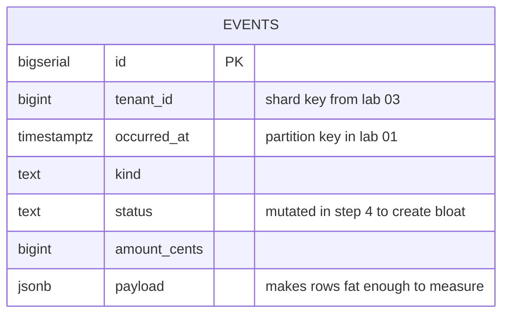
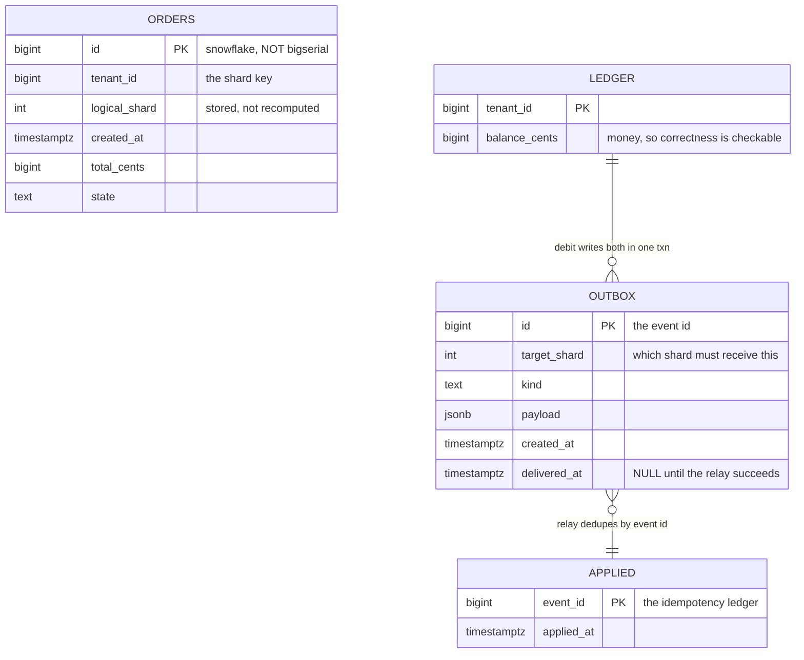
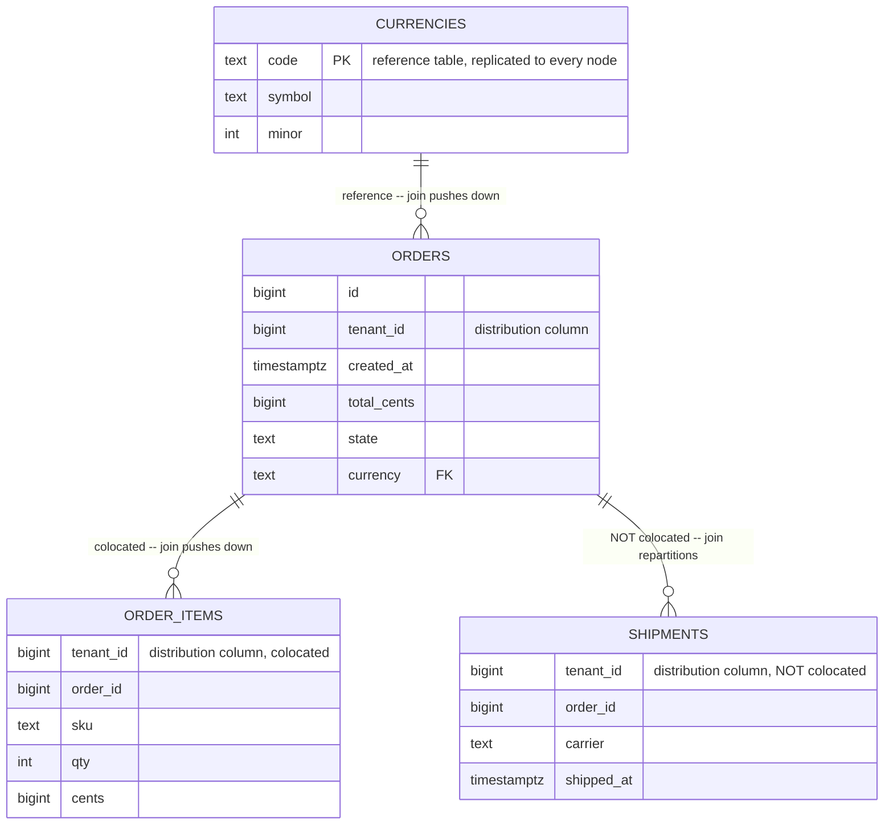

# Data model across the labs

One entity, modelled seven ways. The columns barely change from lab 00 to lab 07;
what changes is *where the rows live* and *what that costs you*. Reading the
schemas side by side is the fastest way to see what each scaling technique
actually takes away.

## The through-line

```
lab 00   events            one table, one node
lab 01   events_p          same columns, RANGE partitioned by time
lab 02   metrics           narrow + high-volume, the shape partman is for
lab 03   orders_h/orders_l HASH by tenant, then LIST for the whales
lab 04   orders            one table per shard, 4 independent databases
lab 05   orders            the same, mid-migration across 8
lab 06   orders            distributed by Citus, 32 shards over 2 workers
lab 07   orders            replicated by logical decoding
```

Three columns survive every rung, and each one becomes a scaling axis:

| Column | Lab 00 role | What it becomes |
|---|---|---|
| `tenant_id` | a filter | the shard key (labs 03-06) |
| `occurred_at` / `created_at` | a filter | the partition key (labs 01-02) |
| `id` | `bigserial` primary key | impossible: see below |

`id` is the instructive one. It starts as the obvious `bigserial PRIMARY KEY` and
gets dismantled twice: lab 01 forces the partition key into the PK, and lab 04
shows that a per-node sequence hands out the same value on every shard. By lab 04
it is an application-generated snowflake.

---

## Lab 00 -- `events`

```sql
CREATE TABLE events (
  id           bigserial   PRIMARY KEY,
  tenant_id    bigint      NOT NULL,
  occurred_at  timestamptz NOT NULL,
  kind         text        NOT NULL,
  status       text        NOT NULL DEFAULT 'new',
  amount_cents bigint      NOT NULL DEFAULT 0,
  payload      jsonb       NOT NULL DEFAULT '{}'::jsonb
);
```

Every column earns its place by enabling a specific measurement:

| Column | Why it exists |
|---|---|
| `id bigserial PK` | The naive choice, present so labs 01 and 04 can take it away |
| `tenant_id` | The multi-tenant dimension; the shard key from lab 03 onward |
| `occurred_at` | The time dimension; the partition key in lab 01; drives retention |
| `kind` | Low-cardinality categorical, so `GROUP BY` has something to chew |
| `status` | **The mutable column.** Exists so step 4 can `UPDATE` it and manufacture dead tuples |
| `amount_cents` | Gives aggregates something real to sum; also mutated in step 4 |
| `payload jsonb` | **Makes rows fat.** Without it, 5M rows fit in `shared_buffers` and nothing hurts |

That last one matters more than it looks. The lab is measuring I/O and bloat. A
narrow table of 5M rows is ~350 MB and lives in cache; the jsonb pushes it past
the point where the buffer pool saves you, which is the only reason the numbers
in step 3 mean anything.

Indexes, each mapped to a real access pattern:

| Index | Serves | Fate |
|---|---|---|
| `(tenant_id, occurred_at DESC)` | the API query: one tenant's recent rows | survives everywhere |
| `(occurred_at)` | the reporting query: all tenants, recent window | made redundant by partitioning |
| `(status) WHERE status <> 'done'` | the worker-queue query | partial index; where bloat shows worst |

### ER diagram

`events` is deliberately standalone -- no foreign keys, no children. Lab 00 is
about physical storage, and a relationship would only add noise.



### What each step does

| Step | Does | Look at |
|---|---|---|
| `01-schema.sql` | Creates the flat table and three indexes | -- |
| `02-seed.sql` | Loads `:rows` rows over 12 months, tenant-skewed via `power(random(),3)` | Load time, to compare against lab 01 |
| `03-measure.sql` | Sizes, then three `EXPLAIN (ANALYZE, BUFFERS)` plans | Indexes often exceed the heap |
| `04-vacuum-pain.sql` | `UPDATE` ~10% of rows, then `VACUUM VERBOSE` | `n_dead_tup`, and the heap size before/after |
| `05-delete-pain.sql` | `DELETE` rows older than 300 days, then `VACUUM` | Wall clock, and that the heap never shrinks |

The seed's skew is not decoration. `power(random(), 3) * 500` is Zipf-ish: a
handful of tenants own most rows. That skew is the seed of the whale problem that
labs 03 and 05 spend their time on.

### The lesson in vacuum and delete pain

Postgres never updates a row in place. An `UPDATE` writes a whole new row version
and marks the old one dead. Five consequences, in order of how much they surprise
people:

1. **Updating one column rewrites the entire row**, `payload` jsonb included. Your
   "cheap status flip" moved a kilobyte.
2. **Every index entry must be rewritten too.** HOT (heap-only tuple) updates can
   avoid this, but only if no indexed column changed -- and `status` is indexed,
   so HOT is off the table by construction.
3. **The file grows while the row count does not.** Dead tuples occupy pages until
   vacuumed.
4. **`VACUUM` marks space reusable; it does not give it back to the OS.** Only
   `VACUUM FULL` (rewrites the table under `ACCESS EXCLUSIVE` -- a total outage,
   and needs 2x the disk) or `pg_repack` (online, still needs 2x the disk) shrink
   the file.
5. **Vacuum cost scales with table and index size, not with the size of your
   change.** Deleting one row from a 500M-row table still eventually costs a scan
   proportional to the whole thing.

`DELETE` is the most expensive way in existence to remove data. Per row it writes
a dead tuple and a WAL record; then you owe a `VACUUM` that scans every index to
remove the pointers; and when it finishes, the file is exactly as large as before.

`DROP TABLE` on a partition, by contrast, unlinks a file. No dead tuples, no WAL
per row, no index cleanup, space returned immediately. Lab 01 step 5 performs the
identical retention in milliseconds.

The transferable conclusion is not "partitioning is faster". It is:

> **Retention is a schema design decision, not an operations task.** If you cannot
> say at `CREATE TABLE` time how you will delete this data, you have already lost.
> Deletion is the requirement that must be designed in, and it is the one nobody
> writes on the ticket.

---

## Lab 01 -- `events_p`

Identical columns. Three things change, and all three are constraints, not
features:

```sql
CREATE TABLE events_p (
  ...
  PRIMARY KEY (id, occurred_at)      -- partition key dragged into the PK
) PARTITION BY RANGE (occurred_at);
```

| Change | Consequence |
|---|---|
| PK becomes `(id, occurred_at)` | `WHERE id = ?` alone can never be a single-partition lookup, and **no global unique constraint on an external id is possible, ever** |
| 14 monthly partitions, 13 back and 1 ahead | The "1 ahead" is the outage at midnight on the 1st |
| A `DEFAULT` partition | Catches strays; charges you at the next `ATTACH` (it must be scanned to prove no row belongs in the new range) |

Indexes are declared on the parent and cloned to every partition, existing and
future -- so partition management stays a one-line operation.

---

## Lab 02 -- `attach_demo` and `metrics`

Two schemas, two different points.

**`attach_demo` with `cand_slow` and `cand_fast`** -- two candidate partitions
holding identical 2M-row payloads. The *only* difference is that `cand_fast`
carries a `CHECK` constraint matching its future bounds. Attach both, compare the
timings. That single constraint is the difference between a 2 ms deploy and a
multi-minute `ACCESS EXCLUSIVE` outage, because it lets Postgres trust the range
instead of validating it.

**`metrics`** is deliberately a different shape from `events`:

```sql
CREATE TABLE metrics (
  id        bigserial        NOT NULL,
  tenant_id bigint           NOT NULL,
  bucket    timestamptz      NOT NULL,
  value     double precision NOT NULL,
  PRIMARY KEY (id, bucket)
) PARTITION BY RANGE (bucket);
```

Narrow, high-volume, short-lived, daily partitions, 14-day retention. That is the
shape `pg_partman` is actually built for -- time-series where partitions are
created and destroyed continuously and nobody should be writing DDL by hand.
`events` is a business table you keep; `metrics` is exhaust you rotate.

---

## Lab 03 -- `orders_h` and `orders_l`

```sql
CREATE TABLE orders_h (
  id bigserial, tenant_id bigint, placed_at timestamptz,
  total_cents bigint, state text,
  PRIMARY KEY (tenant_id, id)        -- partition key FIRST, intentional
) PARTITION BY HASH (tenant_id);     -- 8 partitions, MODULUS 8
```

Seeded with `power(random(), 4)` -- harder skew than lab 00, so the whales are
unmistakable in the step 2 report.

`orders_l` is the escape hatch, a two-level tree:

```
orders_l  (LIST on tenant_id)
├── orders_l_t1        tenant 1  -- a whale, its own partition
├── orders_l_t2        tenant 2  -- a whale, its own partition
└── orders_l_rest      DEFAULT, itself PARTITION BY HASH (tenant_id)
    ├── orders_l_rest_0
    ├── orders_l_rest_1
    ├── orders_l_rest_2
    └── orders_l_rest_3
```

The lesson the two schemas exist to make unavoidable: **hash gives you even key
distribution, never even row distribution.** No number of hash partitions splits
a single large tenant. LIST-pinning it does. That same shape reappears in lab 05
as `Directory.Pin` and in lab 06 as `isolate_tenant_to_new_shard`.

---

## Lab 04 and 05 -- the shard schema

Four tables, applied identically to every shard. A shard is an ordinary, boring
Postgres database that knows nothing about the others.



There are no foreign keys between these tables, and that is the point: `ORDERS`
and `LEDGER` on shard 0 have no enforceable relationship to anything on shard 3.
Referential integrity stops at the shard boundary. The dotted relationships above
are enforced by application code, not by the database.

| Table | Stores | Why it exists |
|---|---|---|
| `orders` | the domain rows | `id` is an app-generated snowflake because a per-node `bigserial` hands out the same value on all four shards. `logical_shard` is denormalised so migration queries are a cheap range predicate instead of a hash recomputed in SQL |
| `ledger` | balances | Money, so that "did the cross-shard write work?" has an answer you can check rather than eyeball |
| `outbox` | queued cross-shard effects | Written in the **same transaction** as the local effect. One node, one commit, ordinary ACID. The partial index `WHERE delivered_at IS NULL` keeps the relay's poll cheap once millions of delivered rows accumulate |
| `applied` | event ids already processed | **The whole safety property lives in this table.** The relay delivers at-least-once; the primary key on `event_id` is what turns that into effectively-once |

Exercise 5 in lab 04 makes the last row visceral: delete a row from `applied`,
replay the event, and watch a balance get credited twice.

---

## Lab 06 -- Citus

Four tables chosen to demonstrate the four Citus table types and the one trap.



| Table | Type | The point |
|---|---|---|
| `orders` | distributed on `tenant_id`, 32 shards | 32 shards over 2 workers is lab 05's `LogicalCount` idea again: pick high once, then move shards between nodes |
| `order_items` | distributed, `colocate_with => 'orders'` | Shard *i* of both tables covers the same tenant range, so the join runs entirely on the worker |
| `shipments` | distributed, `colocate_with => 'none'` | **The trap.** Same column, same type, same shard count -- identical in every way a reader would check -- and the join still will not push down |
| `currencies` | reference table | One shard replicated in full to every node. Free joins; every write is a cluster-wide 2PC |

`shipments` is the most valuable table in the lab. Colocation is declared, never
inferred, and getting it wrong is a rewrite rather than a tuning knob.

---

## Lab 07 -- publisher and subscriber

Three tables, each present to trigger a specific failure.

| Table | Shape | Failure it demonstrates |
|---|---|---|
| `orders` | normal PK | The control. Replicates without incident |
| `audit_log` | **no PK, no unique index** | `UPDATE`/`DELETE` replication errors outright. Not a strawman -- append-only audit tables are written exactly like this and work fine until the day someone adds them to a publication |
| `pub_marker` | one row: counts + `pg_lsn` | The publisher stamps its own totals; the row replicates, giving the subscriber something authoritative to compare against without a connection back to the publisher |
| `audit_log_seq` | a sequence | Exists to prove **sequences do not replicate** -- the classic failover surprise, where you promote a replica and immediately start handing out duplicate ids |

`audit_log` is the one to sit with. The fix is `REPLICA IDENTITY FULL`, which puts
the entire old row into the WAL and makes the subscriber do a full-row comparison
per change -- a sequential scan per row unless you add a suitable index. The
better fix is a unique index and `REPLICA IDENTITY USING INDEX`.

---

## The one-line summary per lab

| Lab | Stores | Because |
|---|---|---|
| 00 | one fat flat table | to make bloat, vacuum cost and delete cost measurable |
| 01 | the same table, split by month | to make retention a `DROP` instead of a `DELETE` |
| 02 | a wide business table and a narrow metrics table | two different retention shapes need two different tools |
| 03 | the same rows keyed by tenant, hashed then pinned | to prove hashing cannot split a whale |
| 04 | four independent databases plus an outbox and an idempotency ledger | to make cross-shard writes safe without distributed transactions |
| 05 | the same four, mid-migration across eight | to make the dual-write window and the cutover concrete |
| 06 | colocated, non-colocated and reference tables | to show colocation is declared, not inferred |
| 07 | a good table, a PK-less table and a marker row | to show what logical replication cannot carry |
